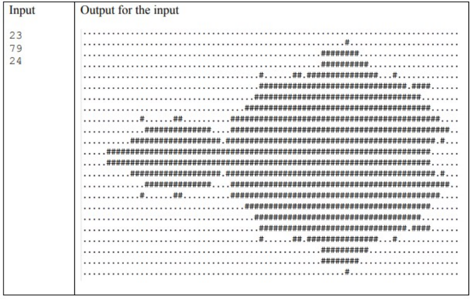

# MandelbrotSet_MPI


The Mandelbrot set is a set of complex numbers. [This code](mandelbrotParalel.cpp) parallelizes the mandelbrot using MPI.



## Getting started

- Download this project;
- [Read the report](TechnicalReport_MandelbrotSetMPI.pdf) (written in brazilian portuguese).

## Step 1: Compiling

```
mpic++ mandelbrot.cpp -o a.out -std=c++11

```

## Step 2: Run

### Option 1: Run with a script

To run the code in several machines, use [this script](arquivo.sh):
```
chmod +x arquivo.sh
./arquivo.sh
```
**Observations**: 
- Keep the *arquivo.sh* script and the [hosts file](hosts) in the same folder as the executable.

### Option 2: Run without a script

```
mpirun -np 4 a.out 1024 768 18000
```


## Results

I used a Intel® Core™ i7-2600 CPU @ 3.40GHz × 8, 4 physical cores and 4 logical cores, 8 GB of RAM and Ubuntu 16.04 LTS 64-bit operating system to run the tests.

#### Input: 
- 1024 rows;
- 768 columns;
- 18000 iterations.

| Threads | Time (sec) | Speedup | Efficiency | Cost (sec) |
| --- | --- | --- | --- | --- |
| 1 | 582,0 | 1 | 100% | 582,0 |
| 2 | 573,4 | 1,0150 | 50,74% | 1146,8 |
| 4 | 201,0 | 2,8955 | 72,39% | 804,0 |
| 8 | 87,2 | 6,6743 | 83,42% | 697,6 | 
| 16 | 41,0 | 14,1951 | 88,71% | 656,0 |
| 32 | 20,0 | 29,1000 | 90,93% | 640,0 |
| 64 | 10,8 | 53,8889 |84,20% | 691,2 |


#### This was an assignment for Parallel and Distributed Programming class by Ph.D Marcelo Trindade Rebonatto from University of Passo Fundo.

